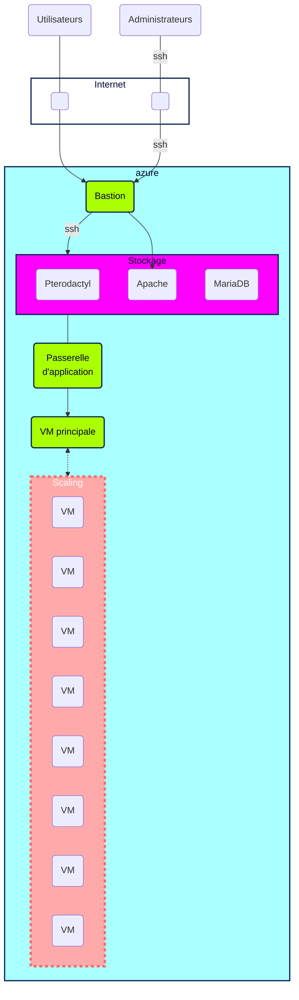

# Infrastructure Plannifiée

Topologie Infrastructure  

```mermaid
flowchart TD 

user(Utilisateurs)
admin(Administrateurs)

    subgraph Web [Internet]
    vide( )
    void( )
    end  

    subgraph AZ [azure]
        subgraph BDD [Stockage]
        app(Pterodactyl)
        apa(Apache)
        bdd(MariaDB)
        end

    Serv(VM principale)
    proxy(Bastion)
    appGW(Passerelle <br> d'application)

        subgraph VM [Scaling]
        vm1(VM)
        vm2(VM)
        vm3(VM)
        vm4(VM)
        vm5(VM)
        vm6(VM)
        vm7(VM)
        vm8(VM)
        end

    end 

user --- vide --> proxy --> apa
admin --- |ssh| void --> |ssh| proxy --> |ssh| BDD
BDD --- appGW --> Serv <-.-> VM

    classDef rouge fill:#faa,stroke:#f66,stroke-width:4px,color:#fff,stroke-dasharray: 5 5;
    class VM, rouge;
    classDef sec fill:#aff,stroke:#025,stroke-width:2px,color:#003;
    class AZ, sec;
    classDef ter fill:#f0f,stroke:#025,stroke-width:2px,color:#003;
    class BDD, ter;
    classDef vert fill:#af0,stroke:#025,stroke-width:2px,color:#003;
    class proxy,appGW,Serv, vert;
    classDef blanc fill:#fff,stroke:#025,stroke-width:2px,color:#003;
    class Web, blanc;

```