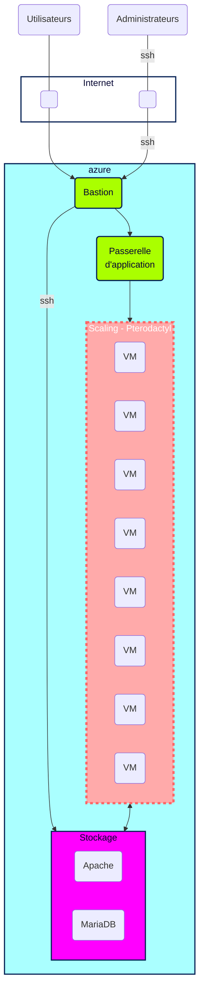

# Plan d'action présentation  

# Plan d'action

00. **Scrum quotidien**
Scrum Master = Luna (appellez-moi Maîtresse! èwé)
Réunions quotidiennes avec compte-rendu immédiat et désignation des premières tâches du jour.
Réunions hebdomadaires avec les autres Scrum Masters avec compte-rendu au groupe par la suite, d'une durée maximum de 5 minute.

01. **Création Kanban**

02. **Lecture des documentations Terraform et Pterodactyl**

03. **Topologie de l'infrastructure**
Infrastructure Plannifiée

04. **Liste ressources Azure**

-----------
| ressource | VM (application) |  MariaDB |
| :--------: | :--------: | :--------: |
| Azure service | ✓ | ✗ |
| ressource groupe | ✓ | ✓ |
| Pterodactyl | ✓ | ✗ |
| Vnet    | ... | ... |
| IP Public | ... | ... (ssh only) |
| subnet     | ... | ... |
| SSH (port) | 80 | 22 |
| Disque | HDD - 4Gb | SSD - 4Gb |
| Ubuntu | 18.04-LTS à maj en 22.04 LTS | 18.04-LTS à maj en 22.04 LTS  |
| Serveur Minecraft | 1.19.2 | ✗  |

Ressource vm:

- Disque : hdd
- RAM: 8Gb (pour une liberté totale, 4Gb si pas de sous)
- Coeur: 1
- OS : Ubuntu

Ressource MariaDB:

- Disque: SSD
- RAM: 4Gb
- Coeur: 1

Ressources : 
- deux ip publiques
- un FQDN
- TLS
- Serveur [Minecraft](https://www.minecraft.net/fr-fr/download/server) à installer version 1.19.2
- Pack chunkloader pour tester la charge
- Wings : permet de contrôler les serveurs Pterodactyl (Minecraft)
- Terraform
- Redis
- Bastion

05. **Liste tâches à faire sur le [Board](https://github.com/users/Simplon-Luna/projects/1/views/1)**
Création et gestion des tâches dans l'ordre du plan d'action. Attribution des tâches aux membres du groupe au fur et à mesure.

06. **Table d'adressage**

07. **Ch 1: déploiement d’une infrastructure minimale** (Python)

08. **Installation de Terraform**

09. **Ch 2: déploiement  BDD** (Mariadb)

10. **Ch 3: déploiement d’un espace de stockage** (NFS?)

11. **Installation de Pterodactyl (sous ubuntu)**

12. **Installation du panel**

13. **Installation de Wings**

14. **Ch 4: script cloud-init**

15. **Ch 5: déploiement d’une application gateway**

16. **Ch 6: mise en place de TLS**

17. **Ch 7: Monitoring de l’application**

18. **Ch 8: script de test de montée en charge**

19. **Ch 9: backup**

20. **Ch 10: scale set** /!\ ***SWITCH APP*** /!\

21. **Ch 11: auto scale**

22. **Les tests et métriques de monitoring**
Nous allons utiliser Azure insight et mesurer : 
- le CPU (utilisation > 80% et température)
- le stockage (limite IO avec alertes si >80% utilisés)
- la RAM (alertes si plus de 6.4GB utilisés = 80%)
- la charge réseau (nombre de connexions et débit, alertes si le débit montant et descendant / connexion explose ou chute drastiquement)
- alerte par mail et en notification si la base de données n'a plus que 20% d'espace libre

23. **Le plan de test de charge**
Utilisation d'un chunkloader au démarrage du serveur. Le chunkloader sera configuré avant d'être lancé et génèrera une forte charge en générant de nombreux blocs d'entités.

24. **Backup** (politique)
Arrêt total du serveur. Envoi d'une requête de sauvegarde sur le serveur de backup (pull backup->DB), une fois terminée envoi un ping de validation (backup->app) permettant le redémarrage du serveur.
Sauvegarde différentielle des données du mardi au dimanche, sauvegarde complète des données le lundi.
Conservation des 12 dernières différentielles et des 8 dernières images complètes.

25. **Stratégie de scaling** (Ansible)
Une fois que l'on a dépassé 80% des 4GB (6.4GB) de ram, un scale out est effectué.
Quand le nombre de connexions dépasse x, les connexions sont bloquées sur le premier serveur et redirigées vers le second serveur (scale out). Une alerte est lancée et permet de déclencher un scale out automatique.
Scale up de la BDD utilisateur après 80% d'utilisation.

26. **Documentations Terraform et Ansible**
Documentation "à la volée" sur ce que l'on a compris lors de notre utilisation de Terraform, des difficultés, des spécificités...

-----------
| ressource | VM (application) |  MariaDB |
| :--------: | :--------: | :--------: |
| Azure service | ✓ | ✗ |
| ressource groupe | ✓ | ✓ |
| Pterodactyl | ✓ | ✗ |
| Vnet    | ... | ... |
| IP Public | ... | ... (ssh only) |
| subnet     | ... | ... |
| SSH (port) | 80 | 22 |
| Disque | HDD - 4Gb | SSD - 4Gb |
| Ubuntu | 18.04-LTS à maj en 22.04 LTS | 18.04-LTS à maj en 22.04 LTS  |
| Serveur Minecraft | 1.19.2 | ✗  |

Ressource vm:

- Disque : hdd
- RAM: 8Gb (pour une liberté totale, 4Gb si pas de sous)
- Coeur: 1
- OS : Ubuntu

Ressource MariaDB:

- Disque: SSD
- RAM: 4Gb
- Coeur: 1

Ressources : 
- deux ip publiques
- un FQDN
- TLS
- Serveur [Minecraft](https://www.minecraft.net/fr-fr/download/server) à installer version 1.19.2
- Pack chunkloader pour tester la charge
- Wings : permet de contrôler les serveurs Pterodactyl (Minecraft)
- Terraform
- Redis
- Bastion
