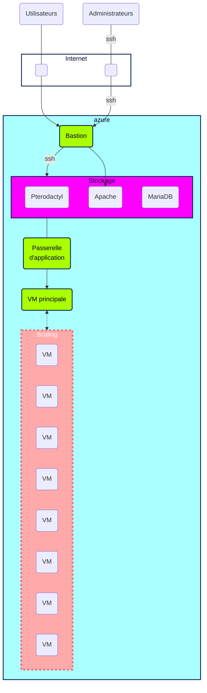

# Plan d'action présentation  

# Plan d'action

00. **Scrum quotidien**
01. **Kanban**
02. **Lecture des documentations Terraform et Pterodactyl**
03. **Topologie de l'infrastructure**
Infrastructure Plannifiée

04. **Liste ressources Azure**

Azure ressource

| ressource | Terraform | Pterodactyl | Bastion  |
| -------- | -------- | -------- | -------- |
| Azure service    | ✓     | ✗    | ✗    |
| ressource groupe    | ✓     | ✓     |✓     |
| VM    | ✓     | ✓     | ✗   |
| Vnet    | ✓    | ✓     | ✓     |
| subnet     | ✓     | ✓     |✓     |
| mariadb     | ✗     | ✗    |✓     |

Ressource vm:

- Disque : hdd
- RAM: 8 giga (16 pour une utilisation réelle)
- Coeur: 1

Ressource MariaDB:

- Disque: SSD
- RAM: 4Gb
- Coeur: 1

05. **Liste tâches à faire sur le [Board](https://github.com/users/Simplon-Luna/projects/1/views/1)**
06. **Table d'adressage**
07. **Ch 1: déploiement d’une infrastructure minimale**
08. **Installation de Terraform**
09. **Ch 2: déploiement  BDD** (Mariadb)
10. **Ch 3: déploiement d’un espace de stockage** (MFS?)
11. **Installation de Pterodactyl (sous ubuntu)**
12. **Installation de Apache**
13. **Installation de Wings**
14. **Ch 4: script cloud-init**
15. **Ch 5: déploiement d’une application gateway**
16. **Ch 6: mise en place de TLS**
17. **Ch 7: Monitoring de l’application**
18. **Ch 8: script de test de montée en charge**
19. **Ch 9: backup**
20. **Ch 10: scale set** /!\ ***SWITCH APP*** /!\
21. **Ch 11: auto scale**
22. **Les tests et métriques de monitoring**
Nous allons utiliser Azure insight et mesurer : le CPU (utilisation en % et température), le stockage (limite IO avec alertes si >80% utilisés), la RAM (alertes si plus de 6.4GB utilisés = 80%), la charge réseau (nombre de connexions et débit, alertes si le débit montant et descendant / connexion explose ou chute drastiquement).
23. **Le plan de test de charge**
Utilisation d'un chunckloader au démarrage de l'application. Le chunkloader sera configuré avant d'être lancé et génèrera une forte charge.
24. **Backup** (politique)
Arrêt total du serveur. Envoi d'une requête de sauvegarde sur le serveur de backup (pull backup->DB), une fois terminée envoi un ping de validation (backup->app) permettant le redémarrage du serveur.
Sauvegarde différentielle des données du mardi au dimanche, sauvegarde complète des données le lundi.
Conservation des 12 dernières différentielles et des 8 dernières images complètes.
25. **Stratégie de scaling** (Ansible)
Une fois que l'on a dépassé 80% des 8GB (6.4GB) de ram, un scale out est effectué.
Quand le nombre de connexions dépasse x, les connexions sont bloquées sur le premier serveur et redirigées vers le second serveur (scale out). Une alerte est lancée et permet de déclencher un scale out automatique.
Scale up de la BDD utilisateur après 80% d'utilisation.
26. **Documentations Terraform et Ansible**

