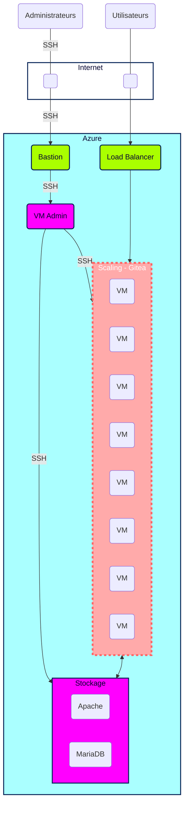

# Plan d'action présentation  

# Plan d'action

00. **Scrum quotidien**
Scrum Master = Luna (appellez-moi Maîtresse! èwé)
Réunions quotidiennes avec compte-rendu immédiat et désignation des premières tâches du jour.
Réunions hebdomadaires avec les autres Scrum Masters avec compte-rendu au groupe par la suite, d'une durée maximum de 5 minute.

01. **Création Kanban**

02. **Lecture des documentations Terraform et Gitea**

03. **Topologie de l'infrastructure**
Infrastructure Plannifiée

04. **Liste ressources Azure**

-----------
| ressource | VM (application) | VM (Admin) |  MariaDB | Bastion |
| :--------: | :--------: | :--------: | :--------: | :--------: |
| Azure service | ✓ | ✓ | ✗ | ✓ |
| ressource groupe | ✓ |✓ | ✓ | ✓ |
| Vnet    | 10.0.0.0/21 | 10.0.0.0/21 | 10.0.0.0/21 | 10.0.4.0/23 |
| Subnet | 10.0.6.0/24 | 10.0.5.0/24 | ... | 10.0.4.0/24 |
| IP Public | Dyn | No | No | Dyn |
| SSH (port) | 22 | 22 | 22 | 22 |
| Disque | HDD - 4Gb | HDD - 4Gb | SSD - 4Gb | N/A |
| Ubuntu | 18.04-LTS à maj en 22.04 LTS | 18.04-LTS à maj en 22.04 LTS  | N/A | N/A |

Ressource vm:

- Disque : hdd
- RAM: 4Gb
- Coeur: 1
- OS : Ubuntu

Ressource MariaDB:

- Disque: SSD
- RAM: 4Gb
- Coeur: 1

Ressources : 
- trois ip publiques
- un FQDN
- TLS
- Test de montée en charge
- Terraform
- Bastion

1.   **Liste tâches à faire sur le [Board](https://github.com/users/Simplon-Luna/projects/1/views/1)**
Création et gestion des tâches dans l'ordre du plan d'action. Attribution des tâches aux membres du groupe au fur et à mesure.

1.  **Installation de Terraform**

2.  **Déploiement d’une infrastructure minimale**

3.  **Déploiement  BDD** (Mariadb)

4.   **Déploiement d’un espace de stockage** (SMB)

5.  **Déploiement d’un load balancer**

6.  **Installation de Gitea (sous ubuntu)**

7.  **Script cloud-init**

8.  **Monitoring de l’application**

9.  **script de test de montée en charge**

10. **Backup**

11. **Scale set** /!\ ***SWITCH APP*** /!\

12. **Auto scale**

13. **Les tests et métriques de monitoring**
Nous allons utiliser Azure insight et mesurer : 
- le CPU (utilisation > 90%)
- le stockage (limite BDD stockage < 10% disponible)
- alerte par mail et en notification si alerte déclenchée

19. **Plan de test de charge**
Utilisation d'Azure Load Test

23. **Backup**
TBD

24. **Stratégie de scaling** (Ansible)
Scale set TBD

25. **Documentations Terraform et Ansible**
Documentation "à la volée" sur ce que l'on a compris lors de notre utilisation de Terraform, des difficultés, des spécificités...

